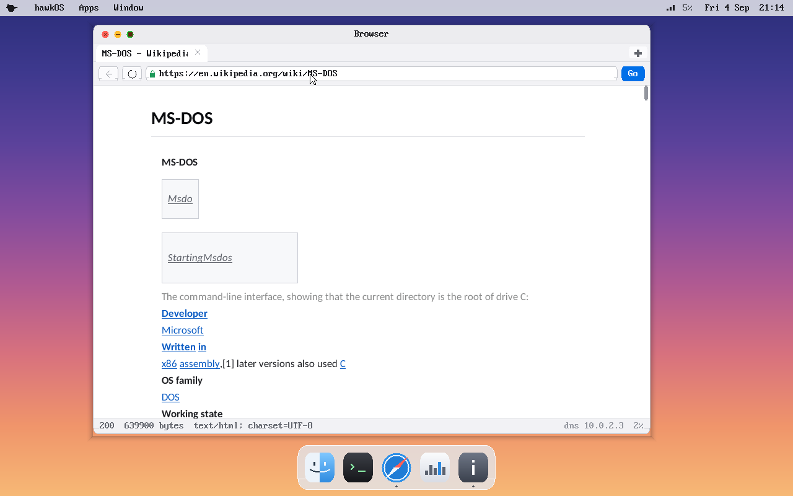
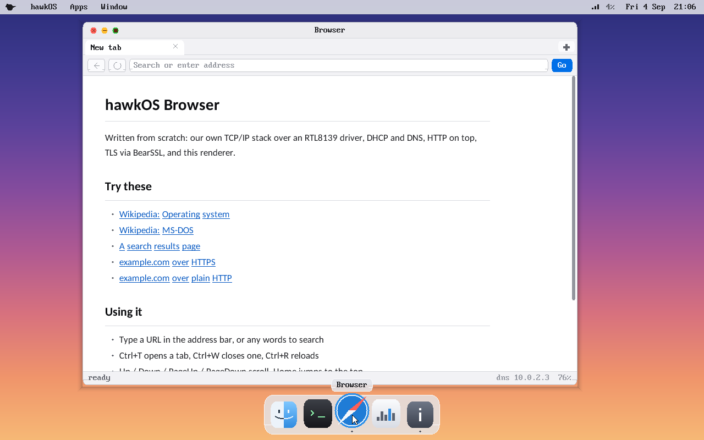
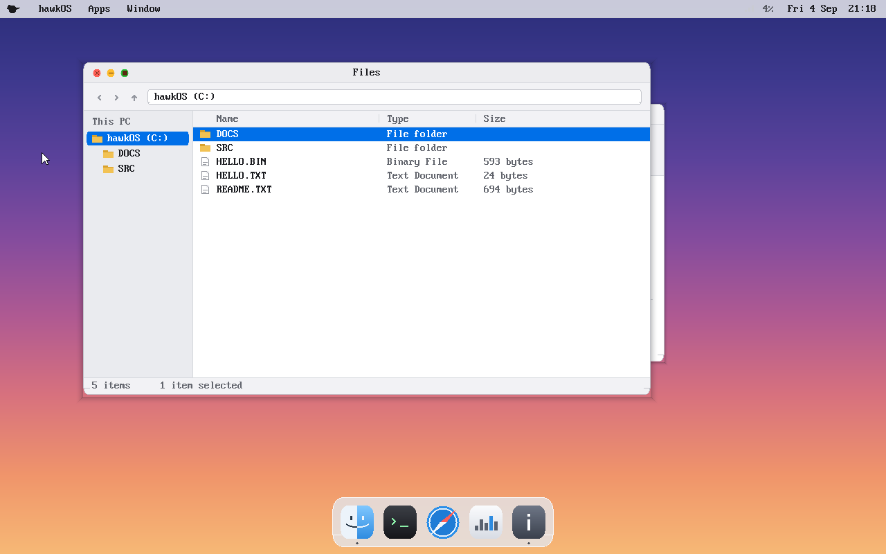
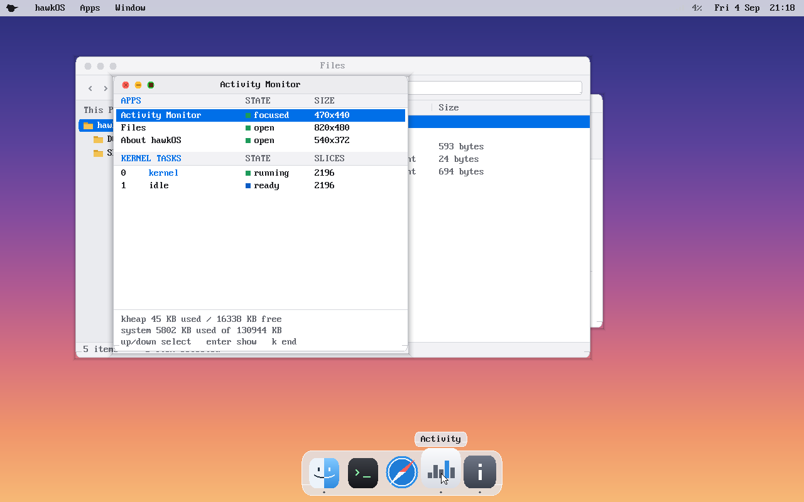
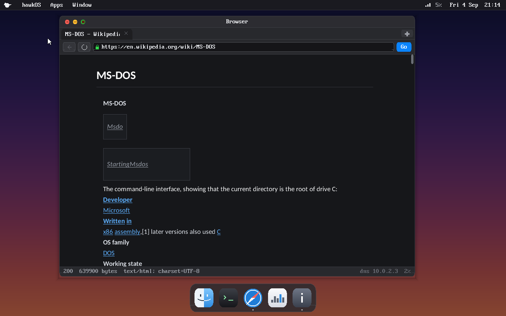
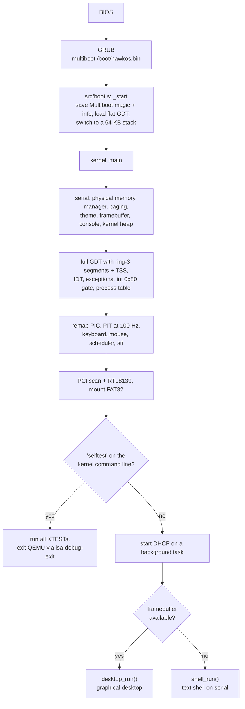

<div align="center">

# hawkOS

### A 32-bit x86 operating system, written from scratch

A preemptive kernel with ring-3 processes, its own TCP/IP stack, and a desktop
whose web browser loads real HTTPS pages — all inside a self-imposed 128 MB budget.

[](https://github.com/NatureHawk/hawkOS/actions/workflows/build.yml)
[](LICENSE)


-555555)


<br>



<sub>The hawkOS browser loading <code>https://en.wikipedia.org/wiki/MS-DOS</code> through the kernel's own TCP/IP stack and BearSSL.</sub>

</div>

---

## At a glance

**What it is.** A hobby operating system for 32-bit protected-mode x86. GRUB
loads it via Multiboot; everything after that is original code. That covers
the memory manager, the scheduler, the drivers, the window manager, the font
renderer, the network stack, the HTTP client and the HTML/CSS layout engine.
The one vendored dependency is [BearSSL](https://bearssl.org/), used for TLS.

**Why it exists.** Modern systems hide an enormous amount behind system calls
and standard libraries. hawkOS builds that back up from nothing so I can
understand it properly: how a machine boots, how interrupts and devices are
driven, how memory is virtualised, and how a desktop and a browser sit on top
of those primitives.

**What it does today.** It boots in QEMU to a graphical desktop with a menu
bar, a dock and five apps: Files, Terminal, Activity Monitor, About and a
tabbed Browser. It gets an IP address by DHCP, resolves names, and fetches and
renders real pages over HTTP and HTTPS. An in-kernel test suite of
**102 tests** runs headless in CI on every push.

> [!NOTE]
> **Current status:** GRUB boot • paging + kernel heap • preemptive multitasking •
> ring-3 processes via `int 0x80` • FAT32 read/write • PS/2 + VMware mouse •
> RTL8139 networking • TCP/IP, DNS, DHCP • HTTP/1.1 + TLS • compositing window
> manager • HTML + CSS-subset browser • in-kernel test suite in CI.
>
> Developed and tested in QEMU only. It has not been verified on real hardware.

---

## Screenshots

<table>
  <tr>
    <td width="50%"></td>
    <td width="50%"></td>
  </tr>
  <tr>
    <td align="center"><sub>Browser start page</sub></td>
    <td align="center"><sub>Files, reading the FAT32 disk image</sub></td>
  </tr>
  <tr>
    <td width="50%"></td>
    <td width="50%"></td>
  </tr>
  <tr>
    <td align="center"><sub>Activity Monitor: windows and kernel tasks</sub></td>
    <td align="center"><sub>Dark appearance; rendered pages are re-coloured too</sub></td>
  </tr>
</table>

All screenshots are real captures. [`tools/shot.py`](tools/shot.py) boots the
ISO headless, drives the mouse and keyboard over QEMU's QMP socket, and saves
the framebuffer. The scripts it replays are in `tools/*.txt`.

---

## What's inside

| Component | Where | What it does |
|---|---|---|
| **Boot** | `src/boot.s`, `grub.cfg` | Multiboot header (requests a 32-bpp framebuffer), saves GRUB's magic and info pointer, loads a flat GDT, sets up a 64 KB stack, calls `kernel_main` |
| **Linker layout** | `linker.ld` | Kernel linked at 1 MiB with 4 KiB-aligned sections, plus a `.ktests` section that collects test descriptors |
| **CPU setup** | `gdt.c`, `gdt.asm`, `idt.c`, `isr*.asm`, `exceptions.c` | GDT with ring-3 segments and a TSS, IDT, CPU exception handlers, remapped 8259 PIC |
| **Memory** | `pmm.c`, `paging.c`, `kheap.c` | Frame bitmap built from GRUB's memory map, paging with the first 128 MB identity-mapped, 16 MB first-fit `kmalloc` heap |
| **Scheduler** | `task.c`, `switch.asm` | Preemptive round-robin on the 100 Hz PIT; 16 kernel threads with 32 KB stacks each; `task_sleep` blocks without spinning |
| **User mode** | `syscall.c`, `syscall.asm`, `proc.c`, `user/` | Ring-3 processes with their own page directory, loaded from FAT32; 8 system calls through `int 0x80` |
| **Drivers** | `kbd.c`, `mouse.c`, `vmmouse.c`, `pit.c`, `rtc.c`, `ata.c`, `pci.c`, `rtl8139.c`, `serial.c` | PS/2 keyboard and mouse (with wheel), VMware absolute pointer, PIT, CMOS clock, ATA PIO read/write, PCI scan, RTL8139 NIC, COM1 serial |
| **Filesystem** | `fat32.c` | FAT32 read, whole-file write, delete, `mkdir`/`rmdir`, cluster allocation, FAT mirroring (8.3 names only) |
| **Networking** | `net.c`, `tcp.c`, `netcfg.c`, `http.c`, `tls.c` | Ethernet, ARP, IPv4, ICMP, UDP, DHCP, DNS, client-side TCP, HTTP/1.1 (redirects, chunked), TLS via BearSSL |
| **Graphics** | `gfx.c`, `fontprop.c`, `font8x16.c`, `theme.c` | Double-buffered framebuffer with clipping; anti-aliased proportional text; light and dark palettes |
| **Desktop** | `wm.c`, `desktop.c`, `app_*.c` | Compositing window manager, menu bar, dock, and the Files, Terminal, Activity Monitor, About and Browser apps |
| **Web engine** | `html.c`, `css.c` | Single-pass HTML tokeniser and layout (no DOM) that emits a flat display list, plus a CSS subset |
| **Tests** | `ktest.c`, `test_*.c`, `tools/layout/` | In-kernel test harness (`make test`) and a host-side layout harness for the HTML engine |

---

## Boot flow

This is the path traced through `src/boot.s` and `src/kernel.c`, in order:



The serial log from a real boot of the ISO under `make run`:

```
[pmm] using multiboot memory map
[paging] enabled, identity-mapped 0..127 MB
[gfx] framebuffer 1280x800 @32bpp, phys=0xFD000000, pitch=5120
[kheap] 16384 KB heap ready
HawkOS: hybrid boot (ASM) + kernel (C)
[syscall] int 0x80 gate installed (8 calls)
[mouse] absolute (vmmouse), with wheel
[sched] preemptive round-robin online (16 slots, 32 KB stacks)
[rtl8139] up at io=c000 irq=11 mac=52:54:00:12:34:56
[fat32] mounted: 512 B/sector, 1 sectors/cluster, root cluster=2, 129022 clusters
[dhcp] ip=10.0.2.15 mask=255.255.255.0 gw=10.0.2.2 dns=10.0.2.3
```

---

## Building and running

> [!IMPORTANT]
> The build targets **Linux**. It is tested on Ubuntu 24.04 (under WSL2) and on
> GitHub's `ubuntu-latest` runner. It uses the host GCC with `-m32 -ffreestanding`
> instead of a dedicated cross-compiler, so it needs `gcc-multilib`.

### 1. Install the toolchain

```sh
sudo apt install build-essential gcc-multilib binutils nasm make \
                 grub-pc-bin grub-efi-amd64-bin xorriso mtools dosfstools \
                 qemu-system-x86
```

| Tool | Used for |
|---|---|
| `gcc` + `gcc-multilib`, `ld` | Compiling the kernel, BearSSL and user programs for i386 |
| `nasm` | Assembly sources (`*.asm`, `src/boot.s`) |
| `grub-mkrescue` + `xorriso` | Wrapping the kernel into a bootable GRUB ISO |
| `mkfs.vfat` (dosfstools), `mcopy` (mtools) | Creating and populating the FAT32 disk image without root |
| `qemu-system-i386` | Running it |

### 2. Build

```sh
make
```

This compiles the vendored BearSSL into `build/libbearssl.a` (first build only),
then the kernel, then the ISO, then the user programs:

| Artifact | Description |
|---|---|
| `hawkos.bin` | The kernel: 32-bit ELF, about 490 KB |
| `hawkos.iso` | Bootable GRUB ISO containing `boot/hawkos.bin` and `boot/grub/grub.cfg` |
| `user/hello.bin` | Ring-3 test program: a flat binary linked at `0x40000000` |
| `build/libbearssl.a` | BearSSL, built for the freestanding target |

### 3. Run

```sh
make run
```

This boots the ISO in QEMU with 128 MB of RAM, a 64 MB FAT32 disk (`disk.img`,
created on first run and never overwritten), an RTL8139 NIC on QEMU's
user-mode network, and serial output to your terminal:

```sh
qemu-system-i386 -m 128M -cdrom hawkos.iso \
  -drive file=disk.img,format=raw,if=ide,index=0,media=disk -boot d \
  -netdev user,id=n0 -device rtl8139,netdev=n0 -serial stdio
```

QEMU's user-mode network gives the guest `10.0.2.15`, with DHCP on `10.0.2.2`
and DNS on `10.0.2.3`. hawkOS configures itself, so there's nothing to set up
on the host.

To give the Files app something to browse, seed the disk image:

```sh
sh tools/seed_disk.sh      # README.TXT, HELLO.TXT, DOCS/, SRC/
make disk-sync             # copies user/hello.bin onto the disk as HELLO.BIN
```

### All targets

| Target | What it does |
|---|---|
| `make` / `make all` | Build `hawkos.iso` and the user programs |
| `make iso` | Build just the kernel and the ISO |
| `make run` | Boot the ISO with disk, NIC and serial on stdio |
| `make run-offline` | Same, with no network card |
| `make run-log` | Same as `run`, with serial written to `serial.log` (useful when stdio misbehaves under WSL) |
| `make run-bin` | Boot `hawkos.bin` directly through QEMU's `-kernel` Multiboot loader, skipping GRUB |
| `make test` | Boot headless with `selftest`, run the in-kernel suite, exit with a pass/fail code |
| `make user` | Build the ring-3 programs in `user/` |
| `make disk-sync` | Copy the user programs onto `disk.img` |
| `make bearssl` | Rebuild the BearSSL archive |
| `make clean` | Remove objects, `hawkos.bin`, `hawkos.iso`, `iso/`, user binaries and `serial.log` (keeps `disk.img` and `build/`) |

Inside the desktop's **Terminal**, `help` lists the commands. Among them are
`meminfo`, `cpuinfo`, `date`, `ls`/`cd`/`cat`, `net`, `dhcp`, `dns <host>`,
`ping <host>`, `fetch <url>`, `ps` and `kill <id>`.

---

## Testing

Tests run **inside the real kernel, against the real allocators and drivers**.
A FAT32 write test that passes against a mock block device has only tested
the mock.

```console
$ make test
=== hawkOS self-test: 102 tests ===
 ok   kstring/memmove_overlaps_both_ways
 ok   fat32/multi_cluster_file_roundtrips
 ok   paging/kernel_pages_are_supervisor_only
 ...
1..102 passed=102 failed=0 skipped=0
--- self-test PASSED
```

Each test registers itself into the `.ktests` linker section, so it lives next
to the code it exercises and there's no central list to keep up to date:

```c
KTEST(fat32, write_read_delete_roundtrip){
    if (!disk_ready()) return;
    KT_EQ(fat32_write_file(TEST_DIR, name, (const uint8_t*)body, len), 0);
    ...
}
```

`make test` boots the kernel with `selftest` on the Multiboot command line and
exits through QEMU's `isa-debug-exit` device. That turns a run into an ordinary
process exit code, which is what the [CI workflow](.github/workflows/build.yml)
fails on.

The HTML engine also has a host-side harness that lays out pinned fixtures
and checks rendering invariants:

```sh
sh tools/layout/run.sh        # "layout: all pages clean"
```

---

## Technical notes

<details open>
<summary><b>Booting with GRUB and Multiboot</b></summary>

<br>

**What:** Multiboot 1 is a contract between a bootloader and a kernel. The
kernel places a magic header in its first 8 KB, and the bootloader loads the
ELF, switches to 32-bit protected mode and jumps to the entry point with
`EAX` = magic and `EBX` = a pointer to an info structure.

**Why:** It skips real-mode boot sectors and A20 handling entirely, and GRUB
also supplies a physical memory map and a graphics framebuffer.

**Here:** `src/boot.s` sets header flags for page-aligned modules, the memory
map and a video mode (it asks for a 32-bpp linear framebuffer). `_start` stores
`EAX`/`EBX` before anything can clobber them, and later `pmm_init` and
`gfx_init` parse the info structure. `gfx_init` uses whatever mode GRUB
actually granted (1280×800 under QEMU) instead of assuming the one it
requested.

</details>

<details>
<summary><b>Linker script and memory layout</b></summary>

<br>

**What:** `linker.ld` places the kernel at physical 1 MiB, with `.multiboot`
first, then `.text`, `.rodata`, `.ktests`, `.data` and `.bss`, each 4 KiB
aligned, and exports `kernel_start`/`kernel_end`.

**Why:** Page-aligned sections let paging and the frame allocator treat the
kernel image as whole pages, and the frame allocator reserves exactly
`kernel_start..kernel_end`.

**Here:** The `.ktests` section is wrapped in `KEEP()` with start and end
symbols, so the test runner simply walks an array the linker built. User
programs have a separate linker script (`user/user.ld`) that produces flat
binaries at `0x40000000`, well outside the kernel's identity-mapped 0–128 MB.

</details>

<details>
<summary><b>Interrupts, exceptions and the timer</b></summary>

<br>

**What:** The IDT maps CPU exceptions (vectors 0–31), hardware IRQs and the
system-call vector to handlers.

**Why:** Nothing is preemptive, and no device can be serviced without
blocking, until the timer and the devices can interrupt the CPU.

**Here:** The 8259 PIC is remapped to vectors `0x20`/`0x28` so IRQs don't
collide with exceptions. IRQ0 (PIT at 100 Hz), IRQ1 (keyboard), IRQ2 (cascade)
and IRQ12 (mouse) are unmasked. The handler checks the saved code selector. A
fault in the kernel prints the exception name and error code, then halts. A
fault from ring 3 terminates only that process.

</details>

<details>
<summary><b>Preemptive multitasking</b></summary>

<br>

**What:** A round-robin scheduler driven by the PIT interrupt, with the
register save and stack swap done in `src/switch.asm`.

**Why:** The desktop, the network receive loop, DHCP and page loads all need
to make progress at the same time.

**Here:** The boot context is adopted as task 0 before interrupts are enabled,
so the first tick already has a valid task table. There are up to 16 kernel
threads, each with a 32 KB stack. `task_sleep` blocks a task instead of
spinning, and the Activity Monitor reads the task table directly.

</details>

<details>
<summary><b>Ring 3 and system calls</b></summary>

<br>

**What:** User processes run at CPL 3 with their own page directory, and they
can reach the kernel only through `int 0x80`, the only IDT gate with DPL 3.

**Why:** Without a privilege boundary, every "program" is just kernel code and
can take the whole machine down with it.

**Here:** The GDT is rebuilt in C with ring-3 segments and a TSS, so a trap
from CPL 3 lands on a kernel stack. Kernel pages carry no `USER` bit, so they
stay mapped for interrupts but can't be touched from ring 3. Every pointer
that comes in through a syscall is bounds-checked against the caller's own
image and stack. There are 8 calls: `exit`, `write`, `getpid`, `yield`,
`sleep`, `ticks`, `open` and `read`. `user/hello.c` tests the boundary on
purpose; this is its real output from `make test`:

```
[proc] HELLO.BIN loaded: 593 bytes at 0x40000000, task 4
hello from ring 3
  pid   = 8
  ticks = 358
  tick 0
  tick 1
  tick 2
attempting to read kernel memory at 0x100000...
[fault] Page Fault in pid 8 (err=5, addr=0x00100000) - process terminated
[proc] HELLO.BIN exited with -1
```

</details>

<details>
<summary><b>Networking and TLS without a libc</b></summary>

<br>

**What:** Ethernet frames from the RTL8139 go up through ARP, IPv4, ICMP, UDP
(for DHCP and DNS) and a client-side TCP, and then to HTTP/1.1 with redirects
and chunked decoding.

**Why:** A browser is the project's centrepiece, and it needs every layer
underneath it.

**Here:** All layers up to HTTP are written for this kernel. TLS uses BearSSL,
which suits this environment because it needs no libc beyond a few string
routines and does no dynamic allocation. `compat/` provides the headers it
includes, backed by `src/kstring.c`. `tools/build_bearssl.sh` builds it with
AES-NI, SSE2 and RDRAND paths disabled, because the kernel doesn't enable SSE
or save XMM state across context switches.

</details>

<details>
<summary><b>The rendering engine</b></summary>

<br>

**What:** A single-pass HTML tokeniser and layout engine with no DOM that
emits a flat display list of positioned text runs and boxes. Text is set in
anti-aliased proportional fonts.

**Why:** A DOM plus a cascade is a lot of memory and code for a 128 MB system.
A flat display list is enough to read real pages.

**Here:** It handles block structure, a heading scale, bold and italic, lists,
links, rules, blockquotes, `<pre>`, entity decoding, image placeholders sized
from the markup, and meta refresh, and it reflows on resize. The CSS subset
reads `<style>` and `style=` for `display`, `visibility`, `color`,
`background`, `font-*`, `text-align`, `text-decoration`, `margin-left` and
`padding-left`, with tag, `.class` and `#id` selectors and `@media` blocks.
There's no specificity ordering or box model. The glyph tables in
`src/fontprop.c` were rasterised from the DejaVu and Carlito TrueType outlines
by [`tools/mkfontprop.py`](tools/mkfontprop.py), a dependency-free TrueType
renderer written for this project. The output is committed, so the build
doesn't need to run it. Search goes through DuckDuckGo Lite.

</details>

<details>
<summary><b>The 128 MB budget</b></summary>

<br>

The limit is a design constraint enforced in software, not a hardware
property. Every subsystem is sized to fit regardless of the host: a 4 MB
framebuffer back buffer, a 16 MB kernel heap, a 192 KB TCP receive buffer
per connection and a 1 MB cap on a downloaded page. `meminfo`, the Activity
Monitor and the menu bar all report usage against it.

</details>

---

## Project structure

```
.
├── src/                    the kernel: C and NASM sources (see "What's inside")
│   ├── boot.s              Multiboot header and _start, the kernel entry point
│   ├── kernel.c            kernel_main: initialisation order and hand-off to the desktop
│   └── test_*.c, ktest.c   the in-kernel self-test suite
├── header/                 one public header per subsystem
├── user/                   ring-3 programs (hello.c) and their linker script
├── compat/                 minimal <string.h>/<stdlib.h> so BearSSL builds freestanding
├── third_party/bearssl/    vendored BearSSL (MIT), used for TLS
├── tools/
│   ├── build_bearssl.sh    builds build/libbearssl.a for the i386 freestanding target
│   ├── seed_disk.sh        puts sample files onto disk.img with mtools
│   ├── shot.py             headless QEMU driver that captures screenshots over QMP
│   ├── layout/             host-side layout harness and its HTML fixtures
│   ├── pages/fetch.sh      fetches the (uncommitted) real-world page corpus
│   ├── mkfont*.py          generate the bitmap and anti-aliased fonts
│   └── *.txt               input scripts replayed by shot.py
├── shots/                  screenshots produced by tools/shot.py
├── docs/                   project write-ups (Word and PowerPoint)
├── .github/workflows/      CI: build, then run the self-test suite
├── linker.ld               kernel memory layout and the .ktests section
├── grub.cfg                GRUB menu entry: multiboot /boot/hawkos.bin
├── makefile                build, run and test targets
├── boot.s                  early standalone Multiboot stub, no longer built (src/boot.s is used)
└── LICENSE
```

---

## Status

<table>
<tr>
<td valign="top" width="50%">

### ✅ Implemented

- GRUB Multiboot boot into protected mode
- Physical memory manager, paging, kernel heap
- Preemptive round-robin scheduling
- Ring-3 processes, per-process page tables, `int 0x80`
- PS/2 keyboard and mouse, VMware absolute pointer
- ATA PIO and FAT32 read/write
- RTL8139, TCP/IP, DHCP, DNS, HTTP/1.1, TLS
- Compositing window manager (snap, maximise, resize, `Ctrl+Tab`)
- Light and dark appearances
- Browser with tabs, search, HTML layout and a CSS subset
- 102 in-kernel tests, run in CI

</td>
<td valign="top" width="50%">

### ⚠️ Known limitations

- **TLS certificates are not verified.** There's no root CA store, so any
  well-formed chain is accepted. That defeats passive eavesdropping but not
  an active man-in-the-middle. Don't type a password into it. See the top
  of `src/tls.c`.
- Ring-3 programs are launched by the test suite only. There's no shell
  command or app that starts one yet.
- External stylesheets (`<link rel=stylesheet>`) aren't fetched.
- No tables and no image decoding (images get sized placeholders).
- FAT32 uses 8.3 short names only.
- Only tested in QEMU.

</td>
</tr>
</table>

### Roadmap

These are future work and none of them exist yet:

- [ ] TLS certificate verification against a trust store
- [ ] Launching user programs from the Terminal and Files
- [ ] Tables in the layout engine
- [ ] Image decoding (PNG first; frames are already sized and placed)
- [ ] Clipboard and text selection
- [ ] A text editor, now that the disk is writable

---

## What this project exercises

- **Freestanding C and x86 assembly.** No libc anywhere. `kstring.c` provides
  the `mem*`/`str*` routines that GCC emits calls to even under
  `-ffreestanding`, and `libgcc` is linked for 64-bit division on i386.
- **Bootstrapping.** Multiboot headers, GDT and TSS setup, and moving from
  GRUB's environment into the kernel's own.
- **Interrupts and concurrency.** IDT and PIC setup, timer-driven preemption,
  context switching and privilege transitions.
- **Virtual memory.** Frame allocation, page tables, supervisor/user
  separation and per-process address spaces.
- **Device drivers.** Port I/O, PCI enumeration and DMA ring buffers (RTL8139).
- **Protocols.** A TCP/IP stack written for this kernel, up to HTTP, with a
  third-party TLS library integrated into a kernel.
- **Emulator-driven development.** QEMU as the test machine: `isa-debug-exit`
  for CI pass/fail, QMP for scripted GUI testing, and serial logging for
  debugging.

---

## License

MIT. See [LICENSE](LICENSE).

BearSSL (`third_party/bearssl/`) is MIT licensed, copyright Thomas Pornin. See
`third_party/bearssl/LICENSE.txt`. The 8×16 console font is extracted from the
Lat15-VGA16 font in Debian's `console-setup`. The proportional faces are
rasterised from DejaVu (Bitstream Vera license) and Carlito (SIL Open Font
License 1.1).
