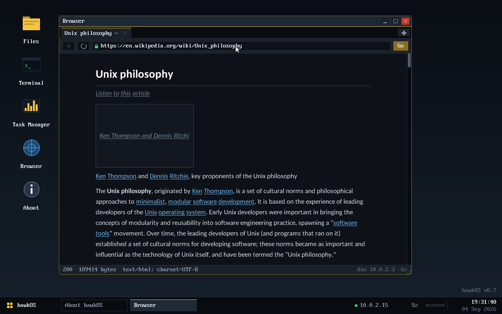
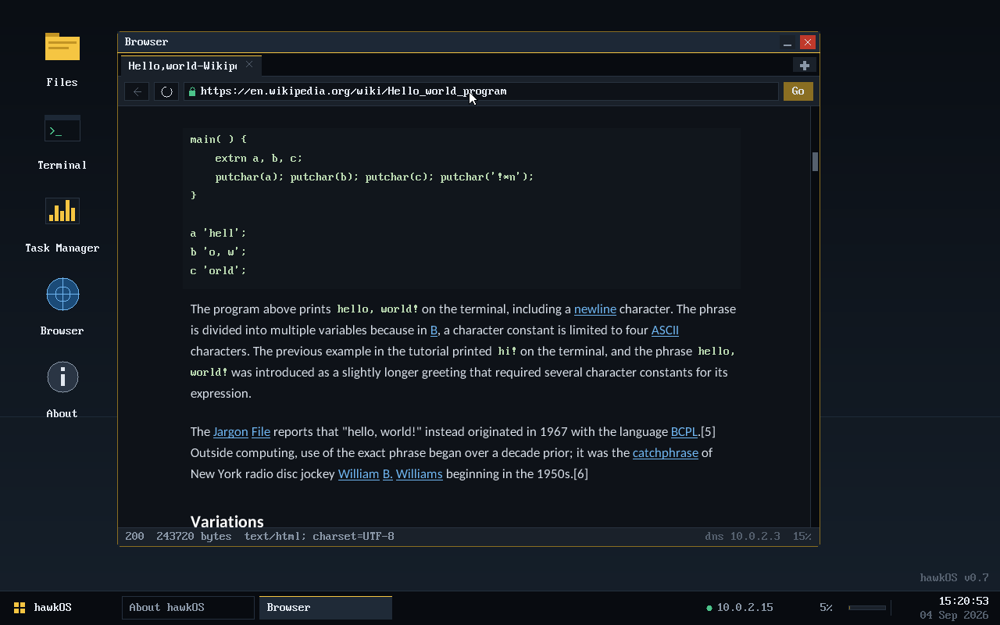
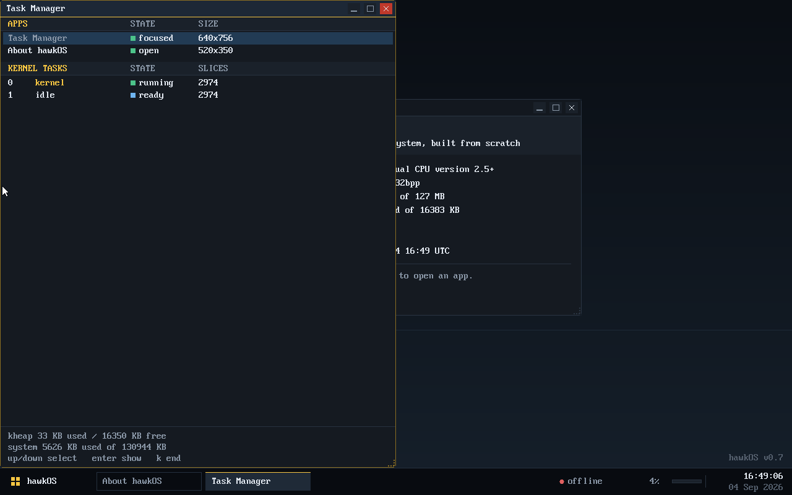
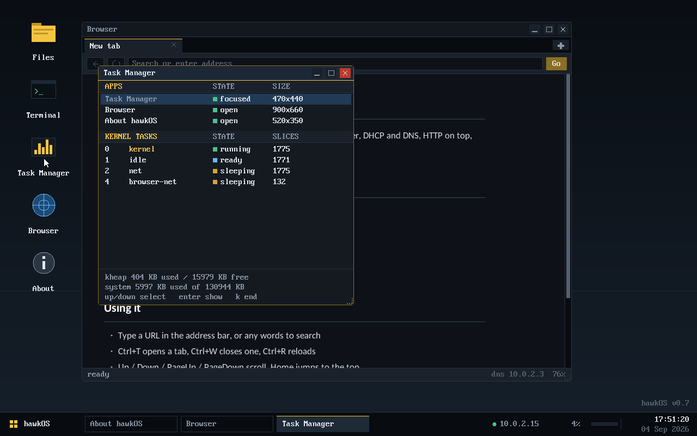

# hawkOS

[](https://github.com/NatureHawk/hawkOS/actions/workflows/build.yml)
[](#testing)
[](LICENSE)
[](#building)
[](#layout)
[](#no-libc)

A hobby operating system for 32-bit x86, written from scratch. It boots with
GRUB, runs a preemptive multitasking kernel with user-mode processes, and comes
up in a graphical desktop with a file manager, a task manager, a terminal, and a
tabbed web browser that fetches real pages over its own TCP/IP and TLS stack.

Everything above the bootloader is original work: the scheduler, the paging
code, the window manager, the font rasteriser, the network stack, the HTTP
client, the HTML layout engine and the CSS subset. The only vendored dependency
is BearSSL, for the TLS handshake.

> **Status:** actively developed, and a hobby project. It is a real operating
> system in the sense that it boots on real hardware and does real work; it is
> not one you should keep anything valuable on. See [Security](#security).

---

## Screenshots

| The browser rendering Wikipedia | A `<pre>` block, with inline `<code>` |
|---|---|
|  |  |

| Window management: snap, resize, maximise | Task Manager: apps and kernel tasks |
|---|---|
|  |  |

---

## Quick start

```sh
make            # build hawkos.iso
make run        # boot in QEMU: 128 MB, NIC attached, serial to stdout
make test       # run the in-kernel self-test suite and exit
```

You need `gcc-multilib`, `binutils`, `nasm`, `make`, `grub-pc-bin`, `xorriso`,
`mtools`, `dosfstools` and `qemu-system-i386`. On Debian or Ubuntu:

```sh
sudo apt install build-essential gcc-multilib binutils nasm make \
                 grub-pc-bin grub-efi-amd64-bin xorriso mtools dosfstools \
                 qemu-system-x86
```

Other targets:

| Target | What it does |
|---|---|
| `make run-offline` | Same machine with no NIC, to exercise that path |
| `make run-log` | Serial to `serial.log` instead of the terminal |
| `make test` | Boot headless, run the self-test, exit with a CI-usable code |
| `make user` | Build the ring-3 user programs under `user/` |
| `make disk-sync` | Copy the built user programs onto the FAT32 image |

`make run` attaches the NIC hawkOS has a driver for, on QEMU's user-mode
network — no bridge and no host configuration:

```
-netdev user,id=n0 -device rtl8139,netdev=n0
```

That gives the guest 10.0.2.15, a DHCP server on 10.0.2.2 and DNS on 10.0.2.3.
hawkOS runs DHCP itself at boot on a background task, so there is nothing to
configure inside it; the taskbar tray shows the address it got, and `net`,
`dhcp`, `dns <host>` and `ping <host>` in the Terminal inspect and redo it.

---

## What is in it

### Boot and memory

A Multiboot header requests a linear framebuffer from GRUB; `boot.s` hands
control to C after loading a flat GDT. The physical memory manager reads GRUB's
memory map into a frame bitmap, paging identity-maps RAM, and a first-fit
free-list allocator provides `kmalloc`.

### Multitasking and user mode

A round-robin scheduler preempts on the 100 Hz PIT interrupt. `src/switch.asm`
swaps kernel stacks; kernel threads get their own 32 KB stack, and `task_sleep`
blocks without spinning, which is what lets the network and browser tasks
coexist with the compositor.

Above that, **user processes run in ring 3 with their own page directory**. A
process reaches the kernel only through `int 0x80` — the single gate in the
whole IDT with DPL 3 — and every pointer that arrives through it is bounds
checked against the caller's own image and stack. Kernel pages carry no `USER`
bit, so kernel memory stays mapped for interrupts and unreachable from a
program. A fault in a user process kills the process, not the machine.

```
hello from ring 3
  pid   = 8
  ticks = 199
  tick 0
  tick 1
  tick 2
attempting to read kernel memory at 0x100000...
[fault] Page Fault in pid 8 (err=5, addr=0x00100000) - process terminated
```

### Devices

PS/2 keyboard and mouse (including the IntelliMouse scroll wheel), PIT, CMOS
RTC, ATA PIO disk with **read and write**, a FAT32 driver with whole-file
writes, `mkdir`/`rmdir` and cluster allocation, and an RTL8139 Ethernet driver
found by scanning the PCI bus.

The mouse prefers **absolute** positioning via the VMware pointer protocol that
QEMU emulates on port 0x5658 ([`vmmouse.c`](src/vmmouse.c)), falling back to
relative PS/2 when no vmport is present. This matters more than it sounds: with
a relative pointer the guest draws its cursor from accumulated deltas while the
host draws its own from the real pointer, and the two drift apart for good the
first time the guest clamps at a screen edge.

### Graphics and the desktop

A double-buffered framebuffer with clipping, and a compositing window manager
with move, resize from any edge or corner, maximise, snap to half the screen,
minimise, z-order, and `Ctrl+Tab` cycling. The desktop adds a launcher menu,
window buttons, and a status tray with the network address, live memory use
against the 128 MB budget, and a clock.

Text is set in **anti-aliased proportional fonts**, rasterised from TrueType
outlines by [`tools/mkfontprop.py`](tools/mkfontprop.py) — a dependency-free
TrueType renderer written for this project, because the build box has neither
freetype nor Pillow. One byte of coverage per pixel, blended against whatever
is behind it. The 8×16 console font is still there, where a fixed cell is what
you want: the terminal, and `<pre>` blocks.

### Networking

Ethernet, ARP, IPv4, ICMP, UDP, DHCP, DNS and a client-side TCP, all written
for this kernel. HTTP/1.1 on top with redirects and chunked transfer decoding.
TLS comes from BearSSL, vendored under `third_party/` and compiled for the
freestanding target.

### Browser

Tabs, an address bar that searches when what you typed is not a URL, back,
reload, and a single-pass HTML tokeniser and layout engine — no DOM — that
emits a flat display list of positioned runs and boxes.

It handles block structure, a real typographic scale for headings, bold and
italic, lists with hanging markers, links, rules, blockquotes, preformatted
text, image placeholders sized from the markup, entity decoding, and meta
refresh. Text is set in a readability-capped measure rather than run to the
full window width, and the page reflows when the window is resized.

There is also a **CSS subset**: `<style>` elements and `style=` attributes are
parsed for `display`, `color`, `background`, `font-size`, `font-weight`,
`font-style`, `font-family`, `text-align`, `text-decoration` and
`margin`/`padding-left`, with tag, `.class` and `#id` selectors, selector
lists, comments and `@media` blocks. It is not a cascade — there is no
specificity ordering and no box model, both of which need a DOM — but it is
enough that a page's own `display: none` decides what is furniture, which is a
far better signal than guessing from class names.

Search results go through DuckDuckGo's HTML-only endpoint; result links are
unwrapped from the engine's redirector so a click goes straight to the
destination.

**Known limitation:** external stylesheets (`<link rel=stylesheet>`) are not
fetched, so sites that keep their rules in one — Wikipedia among them — are
still rendered from their markup alone.

---

## The 128 MB budget

The 128 MB limit is a design constraint enforced in software, not a property of
the hardware. Every subsystem is sized to fit inside it regardless of how much
RAM the host has: a 4 MB framebuffer back buffer, a 16 MB kernel heap, a 192 KB
TCP receive buffer per connection, a 1 MB cap on a downloaded page. `meminfo`
in the Terminal, the Task Manager, and the taskbar tray all report actual usage
against it.

---

## Testing

hawkOS has an in-kernel test harness. Tests run **inside the real kernel, on the
hardware it targets, against the real allocators and drivers** — a FAT32 write
test that passes against a mock block device has tested the mock.

```sh
$ make test
=== hawkOS self-test: 102 tests ===
 ok   kstring/memmove_overlaps_both_ways
 ok   pmm/used_kb_tracks_kmalloc
 ok   fat32/multi_cluster_file_roundtrips
 ok   paging/kernel_pages_are_supervisor_only
 ...
1..102 passed=102 failed=0 skipped=0
--- self-test PASSED
```

A test registers itself into a `.ktests` linker section, so tests live beside
the code they exercise and nothing has to maintain a central list:

```c
KTEST(fat32, write_read_delete_roundtrip){
    if (!disk_ready()) return;
    KT_EQ(fat32_write_file(TEST_DIR, name, (const uint8_t*)body, len), 0);
    fat32_dirent_t f;
    KT_EQ(fat32_find(TEST_DIR, name, &f), 0);
    KT_EQ(f.size, len);
    ...
}
```

`make test` boots the kernel headless with `selftest` on the multiboot command
line and exits through QEMU's `isa-debug-exit` device, so a run is a normal
process that succeeds or fails rather than a VM someone has to watch.

The GUI is tested separately by [`tools/shot.py`](tools/shot.py), which boots
hawkOS headless, drives the mouse and keyboard over QEMU's QMP socket, and
captures PNGs — the screenshots above are generated that way.

---

## Layout

```
boot.s              multiboot header, entry point
linker.ld           kernel layout, and the .ktests section
header/             public headers, one per subsystem
src/                the kernel
  pmm.c paging.c kheap.c        memory
  task.c switch.asm             scheduler
  gdt.c syscall.c proc.c        ring 3, system calls, user processes
  gfx.c fontprop.c wm.c         graphics, fonts, window manager
  desktop.c app_*.c             the desktop and its apps
  net.c tcp.c http.c tls.c      networking
  html.c css.c                  the rendering engine
  test_*.c ktest.c              the self-test suite
user/               ring-3 programs, built as flat binaries
tools/              build and test tooling
third_party/        vendored BearSSL
```

<a name="no-libc"></a>
There is no libc. `header/kstring.h` provides the handful of routines the kernel
needs — the `mem*`/`str*` names are deliberate, since GCC lowers struct
assignment into calls to them even under `-ffreestanding`.

---

## Security

TLS certificates are parsed but **not verified against a trust store**. hawkOS
ships no root CA bundle, so `src/tls.c` installs an X.509 engine that accepts
any well-formed chain. Traffic is genuinely encrypted, which defeats passive
eavesdropping, but not an active man-in-the-middle. The reasoning is written out
at the top of that file.

**It is not a browser to type a password into.** Certificate verification is on
the roadmap.

---

## Roadmap

- [x] Preemptive multitasking
- [x] Compositing window manager with full window management
- [x] TCP/IP, TLS, HTTP
- [x] HTML layout with proportional anti-aliased text
- [x] FAT32 writes
- [x] Ring-3 user processes with per-process address spaces
- [x] CSS subset
- [ ] TLS certificate verification against a trust store
- [ ] Tables in the layout engine
- [ ] Image decoding (PNG first — the frames are already sized and placed)
- [ ] A system clipboard and text selection
- [ ] A text editor, now that the disk is writable

---

## Contributing

Issues and pull requests are welcome. Two things to know:

1. **`make test` has to pass.** If you are adding a subsystem, add tests for it
   next to it — `KTEST(suite, name)` and the assertions in
   [`header/ktest.h`](header/ktest.h).
2. **Comments explain why, not what.** The codebase is meant to be readable by
   someone learning how these pieces fit together, so a non-obvious decision
   should say what it is trading off.

---

## License

MIT — see [LICENSE](LICENSE).

BearSSL, under `third_party/bearssl/`, is MIT licensed and copyright Thomas
Pornin; see `third_party/bearssl/LICENSE.txt`.

The 8×16 console font is extracted from the Lat15-VGA16 console font shipped
with Debian's `console-setup`. The proportional faces are rasterised from
Carlito, which is SIL Open Font License 1.1.
