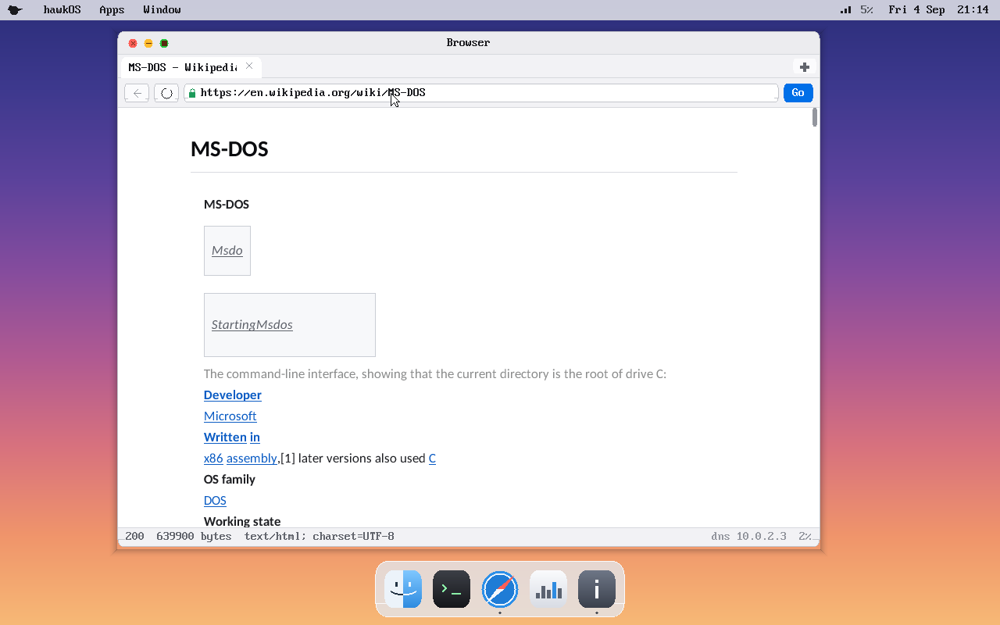
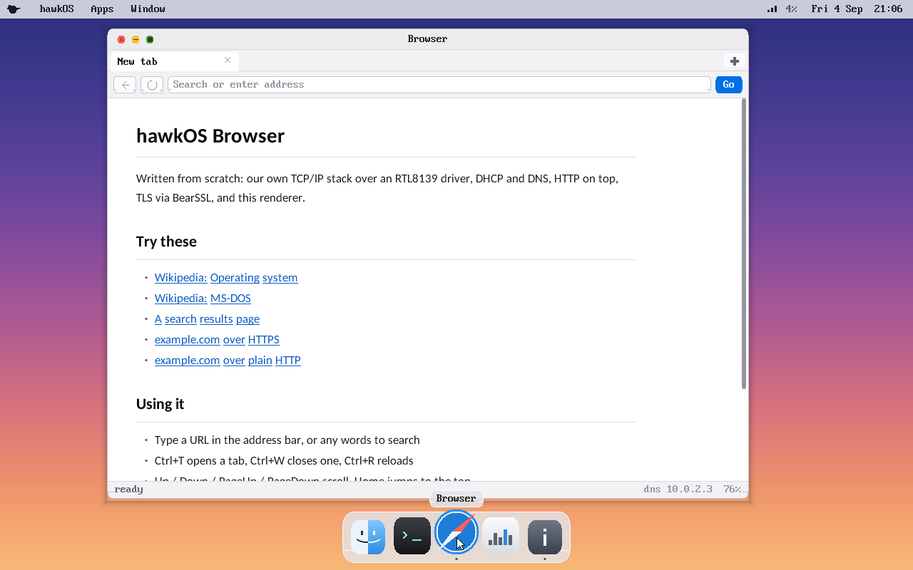
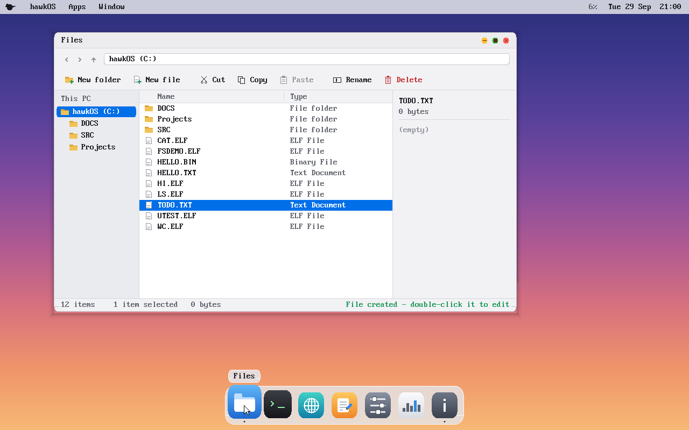
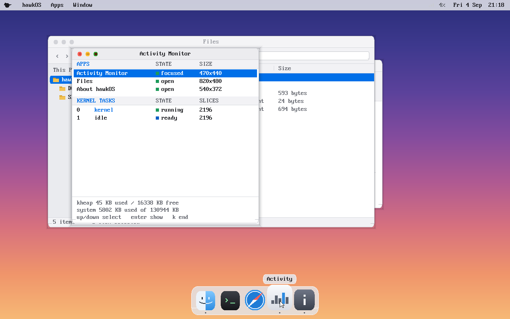
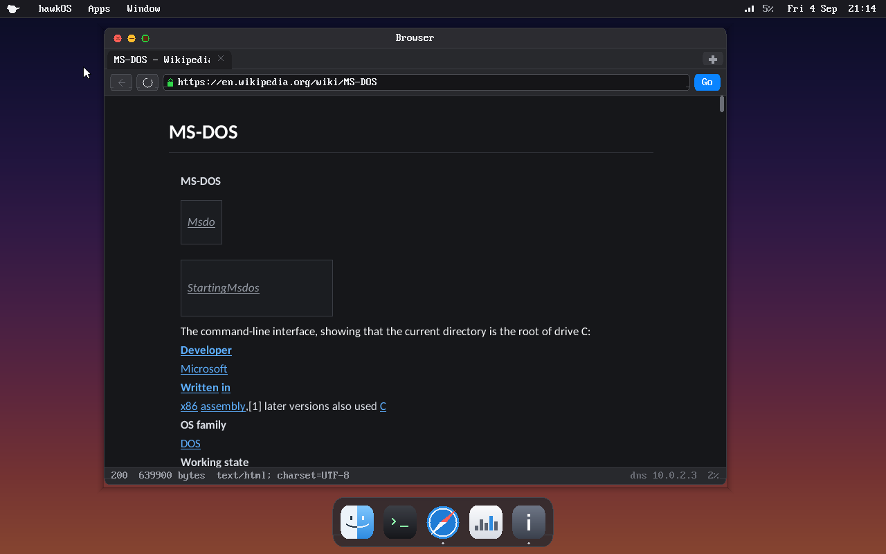
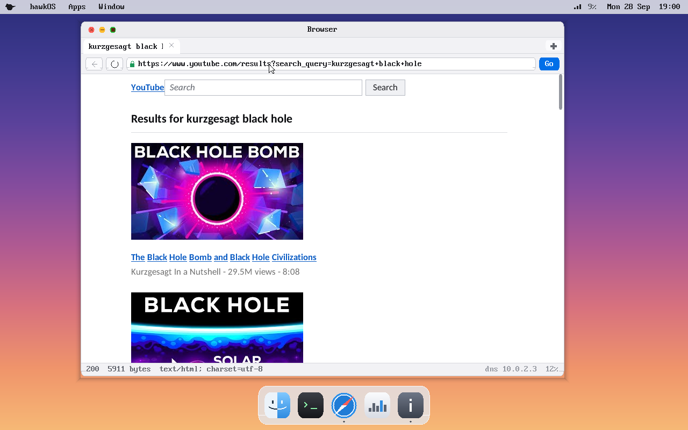
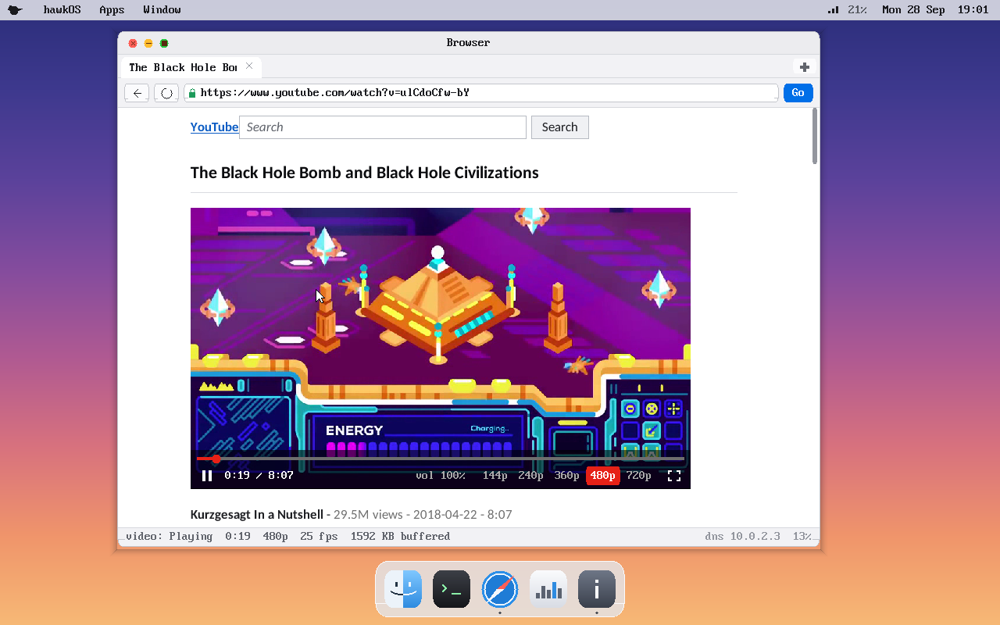
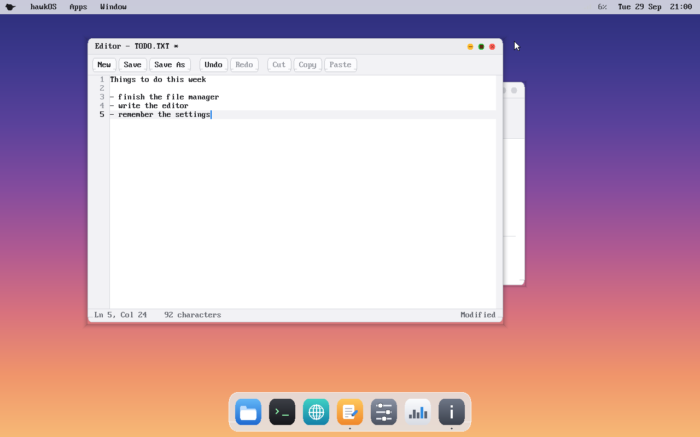
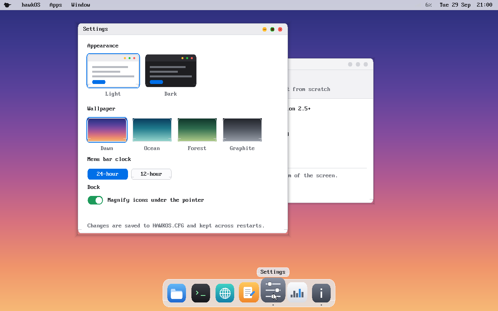
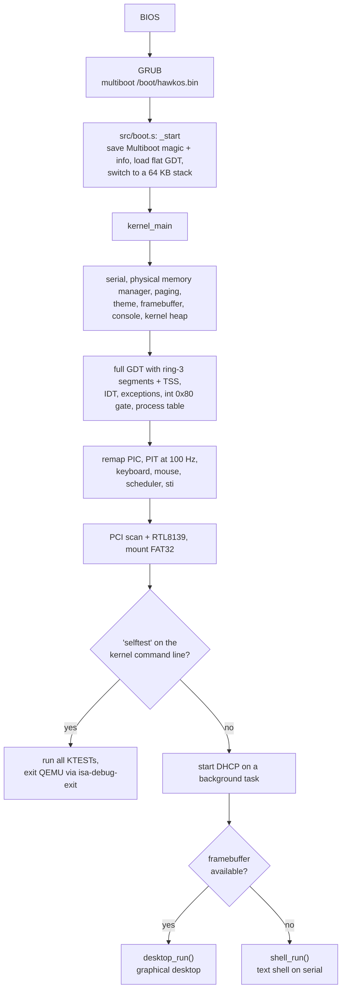

<div align="center">

# hawkOS

### A 32-bit x86 operating system, written from scratch

A preemptive kernel with ring-3 processes, its own TCP/IP stack, and a desktop
whose web browser loads real HTTPS pages — all inside a self-imposed 128 MB budget.

[](https://github.com/NatureHawk/hawkOS/actions/workflows/build.yml)
[](LICENSE)


-555555)


<br>



<sub>The hawkOS browser loading <code>https://en.wikipedia.org/wiki/MS-DOS</code> through the kernel's own TCP/IP stack and BearSSL.</sub>

</div>

---

## At a glance

**What it is.** A hobby operating system for 32-bit protected-mode x86. GRUB
loads it via Multiboot; everything after that is original code. That covers
the memory manager, the scheduler, the drivers, the window manager, the font
renderer, the network stack, the HTTP client and the HTML/CSS layout engine.
Three libraries are vendored: [BearSSL](https://bearssl.org/) for TLS,
[PL_MPEG](https://github.com/phoboslab/pl_mpeg) for MPEG-1 video and MP2
audio, and [stb_image](https://github.com/nothings/stb) for JPEG, PNG and GIF.

**Why it exists.** Modern systems hide an enormous amount behind system calls
and standard libraries. hawkOS builds that back up from nothing so I can
understand it properly: how a machine boots, how interrupts and devices are
driven, how memory is virtualised, and how a desktop and a browser sit on top
of those primitives.

**What it does today.** It boots in QEMU to a graphical desktop with a menu
bar, a dock and seven apps: Files, Terminal, Editor, Settings, Activity
Monitor, About and a tabbed Browser. It gets an IP address by DHCP, resolves names, and fetches and
renders real pages over HTTP and HTTPS, images included. It plays YouTube:
search, thumbnails and video with sound, decoded in the kernel and played
through an AC'97 sound card (see [YouTube](#youtube)). An in-kernel test suite
of **215 tests** runs headless in CI on every push.

> [!NOTE]
> **Current status:** GRUB boot • paging + kernel heap • preemptive multitasking •
> ring-3 processes via `int 0x80` • FAT32 read/write • PS/2 + VMware mouse •
> RTL8139 networking • TCP/IP, DNS, DHCP • HTTP/1.1 + TLS • compositing window
> manager • HTML + CSS-subset browser with images • AC'97 sound • MPEG-1 video
> and YouTube playback • in-kernel test suite in CI.
>
> Developed and tested in QEMU only. It has not been verified on real hardware.

---

## Screenshots

<table>
  <tr>
    <td width="50%"></td>
    <td width="50%"></td>
  </tr>
  <tr>
    <td align="center"><sub>Browser start page</sub></td>
    <td align="center"><sub>Files: new folder or file, cut, copy, paste, rename, delete</sub></td>
  </tr>
  <tr>
    <td width="50%"></td>
    <td width="50%"></td>
  </tr>
  <tr>
    <td align="center"><sub>Activity Monitor: windows and kernel tasks</sub></td>
    <td align="center"><sub>Dark appearance; rendered pages are re-coloured too</sub></td>
  </tr>
  <tr>
    <td width="50%"></td>
    <td width="50%"></td>
  </tr>
  <tr>
    <td align="center"><sub>YouTube search, with decoded JPEG thumbnails</sub></td>
    <td align="center"><sub>A YouTube video playing, decoded by the kernel</sub></td>
  </tr>
  <tr>
    <td width="50%"></td>
    <td width="50%"></td>
  </tr>
  <tr>
    <td align="center"><sub>Editor: selection, undo, Save / Save As</sub></td>
    <td align="center"><sub>Settings, remembered across restarts</sub></td>
  </tr>
</table>

All screenshots are real captures. [`tools/shot.py`](tools/shot.py) boots the
ISO headless, drives the mouse and keyboard over QEMU's QMP socket, and saves
the framebuffer. The scripts it replays are in `tools/*.txt`. Besides clicks,
drags and typing it can send key chords (`chord ctrl+shift+n`), hold a
modifier (`hold shift` / `release shift`) and multi-click (`dclick 300 200 3`).

---

## Everyday use

Window buttons are at the right of the title bar: minimise, zoom, close. Closing
an editor with unsaved changes asks first.

| | Keys |
|---|---|
| **Clipboard** | `Ctrl+C` copy, `Ctrl+X` cut, `Ctrl+V` paste, `Ctrl+A` select all. Works in the editor, the terminal, the browser's address bar and page fields, and every dialog |
| **Selecting text** | Drag with the mouse; double-click a word, triple-click a line (editor, terminal); `Shift`+arrows/`Home`/`End` (editor). In the browser, drag across the page and `Ctrl+C` |
| **Editor** | `Ctrl+S` save, `Ctrl+Shift+S` save as, `Ctrl+Z` undo, `Ctrl+Y` redo, `Ctrl+N` new, `Ctrl+W` close. Files up to 128 KB |
| **Files** | `Ctrl+C` / `Ctrl+X` / `Ctrl+V` copy, cut, paste files and folders; `Delete` delete; `F2` rename; `Ctrl+N` new text file; `Ctrl+Shift+N` new folder; click, `Ctrl`+click and `Shift`+click to select several. Double-click (or `Enter`) opens a folder, or a text file in the editor |
| **Terminal** | `Ctrl+C` copies the selected text and `Ctrl+V` pastes one line onto the prompt; it never pastes a newline, so pasted text cannot run itself |

Preferences (appearance, wallpaper, clock format, dock magnification) are set in
**Settings** and take effect at once. They are written to `HAWKOS.CFG` in the
root of the disk as plain `key=value` lines, and read back at boot. With no
disk, or a read-only one, they still apply for the session and Settings says
they will not be kept.

---

## What's inside

| Component | Where | What it does |
|---|---|---|
| **Boot** | `src/boot.s`, `grub.cfg` | Multiboot header (requests a 32-bpp framebuffer), saves GRUB's magic and info pointer, loads a flat GDT, sets up a 64 KB stack, calls `kernel_main` |
| **Linker layout** | `linker.ld` | Kernel linked at 1 MiB with 4 KiB-aligned sections, plus a `.ktests` section that collects test descriptors |
| **CPU setup** | `gdt.c`, `gdt.asm`, `idt.c`, `isr*.asm`, `exceptions.c` | GDT with ring-3 segments and a TSS, IDT, CPU exception handlers, remapped 8259 PIC |
| **Memory** | `pmm.c`, `paging.c`, `kheap.c` | Frame bitmap built from GRUB's memory map, paging with the first 128 MB identity-mapped, 64 MB first-fit `kmalloc` heap with `krealloc` |
| **Scheduler** | `task.c`, `switch.asm`, `fpu.c` | Preemptive round-robin on the 100 Hz PIT; 16 kernel threads with 32 KB stacks each; x87/SSE state saved per task; `task_sleep` blocks without spinning |
| **User mode** | `syscall.c`, `syscall.asm`, `proc.c`, `user/` | Ring-3 processes with their own page directory, loaded from FAT32; 8 system calls through `int 0x80` |
| **Drivers** | `kbd.c`, `mouse.c`, `vmmouse.c`, `pit.c`, `rtc.c`, `ata.c`, `pci.c`, `rtl8139.c`, `ac97.c`, `serial.c` | PS/2 keyboard and mouse (with wheel), VMware absolute pointer, PIT, CMOS clock, ATA PIO read/write, PCI scan, RTL8139 NIC, AC'97 audio (bus-master DMA), COM1 serial |
| **Filesystem** | `fat32.c` | FAT32 read, whole-file write, delete, `mkdir`/`rmdir`, cluster allocation, FAT mirroring (8.3 names only) |
| **Networking** | `net.c`, `tcp.c`, `netcfg.c`, `http.c`, `tls.c` | Ethernet, ARP, IPv4, ICMP, UDP, DHCP, DNS, client-side TCP, HTTP/1.1 (redirects, chunked, whole-body or streamed), TLS via BearSSL |
| **Graphics** | `gfx.c`, `fontprop.c`, `font8x16.c`, `theme.c` | Double-buffered framebuffer with clipping; anti-aliased proportional text; light and dark palettes |
| **Desktop** | `wm.c`, `desktop.c`, `app_*.c` | Compositing window manager, menu bar, dock, and the Files, Terminal, Editor, Settings, Activity Monitor, About and Browser apps |
| **Everyday features** | `clipboard.c`, `lineedit.c`, `fsutil.c`, `settings.c`, `app_edit.c`, `app_settings.c` | A shared clipboard (text and files), a single-line text field with selection, copy/move/delete of whole folder trees, preferences saved to `HAWKOS.CFG`, a text editor and the Settings app |
| **Web engine** | `html.c`, `css.c` | Single-pass HTML tokeniser and layout (no DOM) that emits a flat display list, plus a CSS subset |
| **Media** | `image.c`, `video.c`, `lib_*.c` | Image decoding and a 24 MB image cache; a streaming MPEG-1 player (network task, 8 MB ring buffer, decode task, audio-synced) |
| **Tests** | `ktest.c`, `test_*.c`, `tools/layout/` | In-kernel test harness (`make test`) and a host-side layout harness for the HTML engine |

---

## Boot flow

This is the path traced through `src/boot.s` and `src/kernel.c`, in order:


```mermaid
flowchart TD
    A["BIOS"] --> B["GRUB<br/>multiboot /boot/hawkos.bin"]
    B --> C["src/boot.s: _start<br/>save Multiboot magic + info, load flat GDT,<br/>switch to a 64 KB stack"]
    C --> D["kernel_main"]
    D --> E["serial, physical memory manager, paging,<br/>theme, framebuffer, console, kernel heap"]
    E --> F["full GDT with ring-3 segments + TSS,<br/>IDT, exceptions, int 0x80 gate, process table"]
    F --> G["remap PIC, PIT at 100 Hz,<br/>keyboard, mouse, scheduler, sti"]
    G --> H["PCI scan + RTL8139, mount FAT32"]
    H --> I{"'selftest' on the<br/>kernel command line?"}
    I -- yes --> J["run all KTESTs,<br/>exit QEMU via isa-debug-exit"]
    I -- no --> K["start DHCP on a background task"]
    K --> L{"framebuffer<br/>available?"}
    L -- yes --> M["desktop_run()<br/>graphical desktop"]
    L -- no --> N["shell_run()<br/>text shell on serial"]
```

The serial log from a real boot of the ISO under `make run`:

```
[pmm] using multiboot memory map
[paging] enabled, identity-mapped 0..127 MB
[gfx] framebuffer 1280x800 @32bpp, phys=0xFD000000, pitch=5120
[kheap] 65536 KB heap ready
HawkOS: hybrid boot (ASM) + kernel (C)
[syscall] int 0x80 gate installed (8 calls)
[mouse] absolute (vmmouse), with wheel
[fpu] x87 present, fxsave+SSE save
[sched] preemptive round-robin online (16 slots, 32 KB stacks)
[rtl8139] up at io=c400 irq=11 mac=52:54:00:12:34:56
[ac97] up: nam=c000 nabm=c500 irq=11, 44100 Hz
[fat32] mounted: 512 B/sector, 1 sectors/cluster, root cluster=2, 129022 clusters
[dhcp] ip=10.0.2.15 mask=255.255.255.0 gw=10.0.2.2 dns=10.0.2.3
```

---

## Building and running

> [!IMPORTANT]
> The build targets **Linux**. It is tested on Ubuntu 24.04 (under WSL2) and on
> GitHub's `ubuntu-latest` runner. It uses the host GCC with `-m32 -ffreestanding`
> instead of a dedicated cross-compiler, so it needs `gcc-multilib`.

### 1. Install the toolchain

```sh
sudo apt install build-essential gcc-multilib binutils nasm make \
                 grub-pc-bin grub-efi-amd64-bin xorriso mtools dosfstools \
                 qemu-system-x86
```

| Tool | Used for |
|---|---|
| `gcc` + `gcc-multilib`, `ld` | Compiling the kernel, BearSSL and user programs for i386 |
| `nasm` | Assembly sources (`*.asm`, `src/boot.s`) |
| `grub-mkrescue` + `xorriso` | Wrapping the kernel into a bootable GRUB ISO |
| `mkfs.vfat` (dosfstools), `mcopy` (mtools) | Creating and populating the FAT32 disk image without root |
| `qemu-system-i386` | Running it |

### 2. Build

```sh
make
```

This compiles the vendored BearSSL into `build/libbearssl.a` (first build only),
then the kernel, then the ISO, then the user programs:

| Artifact | Description |
|---|---|
| `hawkos.bin` | The kernel: 32-bit ELF, about 660 KB |
| `hawkos.iso` | Bootable GRUB ISO containing `boot/hawkos.bin` and `boot/grub/grub.cfg` |
| `user/hello.bin` | Ring-3 test program: a flat binary linked at `0x40000000` |
| `build/libbearssl.a` | BearSSL, built for the freestanding target |

### 3. Run

```sh
make run
```

This boots the ISO in QEMU with 128 MB of RAM, a 64 MB FAT32 disk (`disk.img`,
created on first run and never overwritten), an RTL8139 NIC on QEMU's
user-mode network, an AC'97 sound card played through PulseAudio (WSLg
provides one), and serial output to your terminal:

```sh
qemu-system-i386 -m 128M -cdrom hawkos.iso \
  -drive file=disk.img,format=raw,if=ide,index=0,media=disk -boot d \
  -netdev user,id=n0 -device rtl8139,netdev=n0 \
  -audiodev pa,id=snd0 -device AC97,audiodev=snd0 -serial stdio
```

`make run AUDIO=` boots without the sound card.

QEMU's user-mode network gives the guest `10.0.2.15`, with DHCP on `10.0.2.2`
and DNS on `10.0.2.3`. hawkOS configures itself, so there's nothing to set up
on the host.

To give the Files app something to browse, seed the disk image:

```sh
sh tools/seed_disk.sh      # README.TXT, HELLO.TXT, DOCS/, SRC/
make disk-sync             # copies user/hello.bin onto the disk as HELLO.BIN
```

### All targets

| Target | What it does |
|---|---|
| `make` / `make all` | Build `hawkos.iso` and the user programs |
| `make iso` | Build just the kernel and the ISO |
| `make run` | Boot the ISO with disk, NIC, sound and serial on stdio |
| `make youtube` | Start the YouTube gateway (`tools/ytgate.py`), boot the ISO, and stop the gateway when QEMU exits |
| `make run-offline` | Same, with no network card |
| `make run-log` | Same as `run`, with serial written to `serial.log` (useful when stdio misbehaves under WSL) |
| `make run-bin` | Boot `hawkos.bin` directly through QEMU's `-kernel` Multiboot loader, skipping GRUB |
| `make test` | Boot headless with `selftest`, run the in-kernel suite, exit with a pass/fail code |
| `make user` | Build the ring-3 programs in `user/` |
| `make disk-sync` | Copy the user programs onto `disk.img` |
| `make bearssl` | Rebuild the BearSSL archive |
| `make clean` | Remove objects, `hawkos.bin`, `hawkos.iso`, `iso/`, user binaries and `serial.log` (keeps `disk.img` and `build/`) |

Inside the desktop's **Terminal**, `help` lists the commands. Among them are
`meminfo`, `cpuinfo`, `date`, `ls`/`cd`/`cat`, `net`, `dhcp`, `dns <host>`,
`ping <host>`, `fetch <url>`, `ps` and `kill <id>`.

---

## Testing

Tests run **inside the real kernel, against the real allocators and drivers**.
A FAT32 write test that passes against a mock block device has only tested
the mock.

```console
$ make test
=== hawkOS self-test: 215 tests ===
 ok   kstring/memmove_overlaps_both_ways
 ok   fat32/multi_cluster_file_roundtrips
 ok   paging/kernel_pages_are_supervisor_only
 ...
1..215 passed=215 failed=0 skipped=0
--- self-test PASSED
```

Each test registers itself into the `.ktests` linker section, so it lives next
to the code it exercises and there's no central list to keep up to date:

```c
KTEST(fat32, write_read_delete_roundtrip){
    if (!disk_ready()) return;
    KT_EQ(fat32_write_file(TEST_DIR, name, (const uint8_t*)body, len), 0);
    ...
}
```

`make test` boots the kernel with `selftest` on the Multiboot command line and
exits through QEMU's `isa-debug-exit` device. That turns a run into an ordinary
process exit code, which is what the [CI workflow](.github/workflows/build.yml)
fails on.

The HTML engine also has a host-side harness that lays out pinned fixtures
and checks rendering invariants:

```sh
sh tools/layout/run.sh        # "layout: all pages clean"
```

---

## Technical notes

<details open>
<summary><b>Booting with GRUB and Multiboot</b></summary>

<br>

**What:** Multiboot 1 is a contract between a bootloader and a kernel. The
kernel places a magic header in its first 8 KB, and the bootloader loads the
ELF, switches to 32-bit protected mode and jumps to the entry point with
`EAX` = magic and `EBX` = a pointer to an info structure.

**Why:** It skips real-mode boot sectors and A20 handling entirely, and GRUB
also supplies a physical memory map and a graphics framebuffer.

**Here:** `src/boot.s` sets header flags for page-aligned modules, the memory
map and a video mode (it asks for a 32-bpp linear framebuffer). `_start` stores
`EAX`/`EBX` before anything can clobber them, and later `pmm_init` and
`gfx_init` parse the info structure. `gfx_init` uses whatever mode GRUB
actually granted (1280×800 under QEMU) instead of assuming the one it
requested.

</details>

<details>
<summary><b>Linker script and memory layout</b></summary>

<br>

**What:** `linker.ld` places the kernel at physical 1 MiB, with `.multiboot`
first, then `.text`, `.rodata`, `.ktests`, `.data` and `.bss`, each 4 KiB
aligned, and exports `kernel_start`/`kernel_end`.

**Why:** Page-aligned sections let paging and the frame allocator treat the
kernel image as whole pages, and the frame allocator reserves exactly
`kernel_start..kernel_end`.

**Here:** The `.ktests` section is wrapped in `KEEP()` with start and end
symbols, so the test runner simply walks an array the linker built. User
programs have a separate linker script (`user/user.ld`) that produces flat
binaries at `0x40000000`, well outside the kernel's identity-mapped 0–128 MB.

</details>

<details>
<summary><b>Interrupts, exceptions and the timer</b></summary>

<br>

**What:** The IDT maps CPU exceptions (vectors 0–31), hardware IRQs and the
system-call vector to handlers.

**Why:** Nothing is preemptive, and no device can be serviced without
blocking, until the timer and the devices can interrupt the CPU.

**Here:** The 8259 PIC is remapped to vectors `0x20`/`0x28` so IRQs don't
collide with exceptions. IRQ0 (PIT at 100 Hz), IRQ1 (keyboard), IRQ2 (cascade)
and IRQ12 (mouse) are unmasked. The handler checks the saved code selector. A
fault in the kernel prints the exception name and error code, then halts. A
fault from ring 3 terminates only that process.

</details>

<details>
<summary><b>Preemptive multitasking</b></summary>

<br>

**What:** A round-robin scheduler driven by the PIT interrupt, with the
register save and stack swap done in `src/switch.asm`.

**Why:** The desktop, the network receive loop, DHCP and page loads all need
to make progress at the same time.

**Here:** The boot context is adopted as task 0 before interrupts are enabled,
so the first tick already has a valid task table. There are up to 16 kernel
threads, each with a 32 KB stack. `task_sleep` blocks a task instead of
spinning, and the Activity Monitor reads the task table directly.

</details>

<details>
<summary><b>Ring 3 and system calls</b></summary>

<br>

**What:** User processes run at CPL 3 with their own page directory, and they
can reach the kernel only through `int 0x80`, the only IDT gate with DPL 3.

**Why:** Without a privilege boundary, every "program" is just kernel code and
can take the whole machine down with it.

**Here:** The GDT is rebuilt in C with ring-3 segments and a TSS, so a trap
from CPL 3 lands on a kernel stack. Kernel pages carry no `USER` bit, so they
stay mapped for interrupts but can't be touched from ring 3. Every pointer
that comes in through a syscall is bounds-checked against the caller's own
image and stack. There are 8 calls: `exit`, `write`, `getpid`, `yield`,
`sleep`, `ticks`, `open` and `read`. `user/hello.c` tests the boundary on
purpose; this is its real output from `make test`:

```
[proc] HELLO.BIN loaded: 593 bytes at 0x40000000, task 4
hello from ring 3
  pid   = 8
  ticks = 358
  tick 0
  tick 1
  tick 2
attempting to read kernel memory at 0x100000...
[fault] Page Fault in pid 8 (err=5, addr=0x00100000) - process terminated
[proc] HELLO.BIN exited with -1
```

</details>

<details>
<summary><b>Networking and TLS without a libc</b></summary>

<br>

**What:** Ethernet frames from the RTL8139 go up through ARP, IPv4, ICMP, UDP
(for DHCP and DNS) and a client-side TCP, and then to HTTP/1.1 with redirects
and chunked decoding.

**Why:** A browser is the project's centrepiece, and it needs every layer
underneath it.

**Here:** All layers up to HTTP are written for this kernel. TLS uses BearSSL,
which suits this environment because it needs no libc beyond a few string
routines and does no dynamic allocation. `compat/` provides the headers it
includes, backed by `src/kstring.c`. `tools/build_bearssl.sh` builds it with
AES-NI, SSE2 and RDRAND paths disabled. The kernel now saves x87 and SSE state
across context switches (`src/fpu.c`), but QEMU's default CPU has no AES-NI or
RDRAND, and the integer paths are the ones that have been tested here.

</details>

<details>
<summary><b>The rendering engine</b></summary>

<br>

**What:** A single-pass HTML tokeniser and layout engine with no DOM that
emits a flat display list of positioned text runs and boxes. Text is set in
anti-aliased proportional fonts.

**Why:** A DOM plus a cascade is a lot of memory and code for a 128 MB system.
A flat display list is enough to read real pages.

**Here:** It handles block structure, a heading scale, bold and italic, lists,
links, rules, blockquotes, `<pre>`, entity decoding, images, `<video>`, and
meta refresh, and it reflows on resize. Images are laid out as frames sized
from the markup. The browser fetches them between page loads, decodes them
with stb_image, and draws them into those frames, so a page is readable before
its pictures arrive. An image inside a link is clickable. The CSS subset
reads `<style>` and `style=` for `display`, `visibility`, `color`,
`background`, `font-*`, `text-align`, `text-decoration`, `margin-left` and
`padding-left`, with tag, `.class` and `#id` selectors and `@media` blocks.
There's no specificity ordering or box model. The glyph tables in
`src/fontprop.c` were rasterised from the DejaVu and Carlito TrueType outlines
by [`tools/mkfontprop.py`](tools/mkfontprop.py), a dependency-free TrueType
renderer written for this project. The output is committed, so the build
doesn't need to run it. Search goes through DuckDuckGo Lite.

</details>

<details>
<summary><b>The 128 MB budget</b></summary>

<br>

The limit is a design constraint enforced in software, not a hardware
property. Every subsystem is sized to fit regardless of the host: a 4 MB
framebuffer back buffer, a 64 MB kernel heap, a 192 KB TCP receive buffer
per connection and a 1 MB cap on a downloaded page. `meminfo`, the Activity
Monitor and the menu bar all report usage against it.

Most of the heap is caches that would otherwise sit empty. Up to 24 MB holds
decoded images, 16 MB holds recently visited pages (so Back needs no
download), and a playing video keeps an 8 MB read-ahead buffer.

</details>

<details>
<summary><b id="youtube">YouTube</b></summary>

<br>

**What:** Type `youtube.com` in the Browser and search from the box at the
top of the page, or type `yt` and your words in the address bar. Results come
back with thumbnails, and a video plays in the page with sound, with
YouTube-style controls:

| | |
|---|---|
| Space, K, or click the picture | play / pause |
| ← / → | back / forward 10 s (presses in a row add up to one jump) |
| click the progress bar | jump there |
| 1 – 5, or the buttons | 144p, 240p, 360p, **480p** (default), 720p |
| F, or the corner button | fullscreen; Esc leaves it |
| M, + / − | mute, volume (↑/↓ and the wheel in fullscreen) |

Everything up to 480p plays at the full 24 fps, in the page or fullscreen, on
QEMU's emulated CPU without KVM, using about a third of the guest CPU in the
page and half fullscreen; 720p manages 21 to 24. Until you pick a quality
yourself it is on auto: three seconds under 20 fps steps it down one level.
`make run` and `make youtube` use KVM when the host allows it
(`sudo usermod -aG kvm $USER`, then restart WSL), which makes all of this
several times faster. Switching quality or
seeking keeps the old picture and sound going until the new stream is ready,
so there is no gap.

**Why this needs help from the host:** YouTube's pages are built by
JavaScript, and its video is VP9, AV1 or H.264 in fragmented MP4, reached
through signed URLs that only YouTube's own player code can compute. No
browser the size of this one can do either. So the browser sends every request
for a YouTube host to a gateway on the host machine, `tools/ytgate.py`. It uses
[yt-dlp](https://github.com/yt-dlp/yt-dlp) to talk to YouTube and answers
hawkOS in formats hawkOS can use:

- server-rendered HTML for the home, search and watch pages,
- relayed JPEG thumbnails, and
- each video transcoded on the fly by ffmpeg to an MPEG-1 video and MP2 audio
  program stream.

The address bar still shows the `youtube.com` address.

**Here:** Everything from the socket up is the kernel's own. A network task
streams the video into an 8 MB ring buffer. A decode task feeds it to PL_MPEG,
converts each picture for the framebuffer, and pushes the sound to the AC'97
driver. The sound is decoded 0.8 s ahead of the picture, which is the time it
then spends queued in the sound card's DMA ring, so picture and sound stay in
step and a busy moment elsewhere does not cause a dropout.

Three things made that smooth rather than merely working:

- **Seeking by index.** YouTube's MP4 streams carry a segment index (`sidx`).
  The gateway reads it and starts downloading at the right byte, so a jump to
  5:00 costs about the same as starting from 0:00. It reports where the new
  stream really starts (`X-Start`) and how long the video is (`X-Duration`).
- **Repainting only the video.** A new frame is not a reason to recomposite
  the desktop. The window manager asks the topmost window to repaint just its
  video rectangle and copies only that to the screen (`WM_EV_VIDEO`). Before
  that, compositing cost more than decoding.
- **Emptying the network card from the timer interrupt.** The card's 32 KB
  receive ring is drained into a 512 KB queue every 10 ms, so a CPU-hungry
  decoder can no longer make it overflow, drop packets and starve the stream.

**Setup:** yt-dlp, ffmpeg and a JavaScript runtime for yt-dlp (deno) on the
host. Static builds in `~/.local/bin` are enough, and no root is needed. Then:

```sh
make youtube
```

Inside the guest the gateway is `http://10.0.2.2:8090`, which QEMU forwards
to the host's loopback. The gateway only listens on `127.0.0.1`.

</details>

---

## Project structure

```
.
├── src/                    the kernel: C and NASM sources (see "What's inside")
│   ├── boot.s              Multiboot header and _start, the kernel entry point
│   ├── kernel.c            kernel_main: initialisation order and hand-off to the desktop
│   └── test_*.c, ktest.c   the in-kernel self-test suite
├── header/                 one public header per subsystem
├── user/                   ring-3 programs (hello.c) and their linker script
├── compat/                 minimal <string.h>/<stdlib.h> so vendored code builds freestanding
├── third_party/bearssl/    vendored BearSSL (MIT), used for TLS
├── third_party/pl_mpeg/    vendored PL_MPEG (MIT): MPEG-1 video, MP2 audio, MPEG-PS
├── third_party/stb/        vendored stb_image (public domain / MIT): JPEG, PNG, GIF, BMP
├── tools/
│   ├── build_bearssl.sh    builds build/libbearssl.a for the i386 freestanding target
│   ├── seed_disk.sh        puts sample files onto disk.img with mtools
│   ├── shot.py             headless QEMU driver that captures screenshots over QMP
│   ├── ytgate.py           the YouTube gateway the browser talks to (runs on the host)
│   ├── layout/             host-side layout harness and its HTML fixtures
│   ├── pages/fetch.sh      fetches the (uncommitted) real-world page corpus
│   ├── mkfont*.py          generate the bitmap and anti-aliased fonts
│   └── *.txt               input scripts replayed by shot.py
├── shots/                  screenshots produced by tools/shot.py
├── docs/                   project write-ups (Word and PowerPoint)
├── .github/workflows/      CI: build, then run the self-test suite
├── linker.ld               kernel memory layout and the .ktests section
├── grub.cfg                GRUB menu entry: multiboot /boot/hawkos.bin
├── makefile                build, run and test targets
├── boot.s                  early standalone Multiboot stub, no longer built (src/boot.s is used)
└── LICENSE
```

---

## Status

<table>
<tr>
<td valign="top" width="50%">

### ✅ Implemented

- GRUB Multiboot boot into protected mode
- Physical memory manager, paging, kernel heap
- Preemptive round-robin scheduling
- Ring-3 ELF processes with 32 system calls, `int 0x80`
- Virtual memory: demand paging, stack growth, copy-on-write, `brk`/`mmap`
- VFS with long file names, `/dev`, per-process file descriptors, pipes
- Signals (`kill`, SIGTERM/SIGINT/SIGKILL), `waitpid`
- Mutexes, semaphores and wait queues; no polling waits
- ACPI shut down and restart, LAPIC timer, IDE bus-master DMA
- PS/2 keyboard and mouse, VMware absolute pointer
- ATA PIO and FAT32 read/write
- RTL8139, TCP/IP, DHCP, DNS, HTTP/1.1, TLS
- AC'97 sound
- Compositing window manager (snap, maximise, resize, `Ctrl+Tab`)
- Light and dark appearances, wallpapers, 12/24-hour clock; all remembered across restarts
- Clipboard, and text selection with the mouse or Shift+arrows in the editor, terminal and browser
- Text editor: open, edit, undo/redo, Save / Save As, unsaved-changes prompt
- Files: new folder and file, cut / copy / paste, rename, delete (folders included), multi-select
- Browser with tabs, search, HTML layout, a CSS subset, images and forms
- Page cache: Back is instant and returns to where you were
- MPEG-1 video playback and YouTube (through the host gateway)
- 215 in-kernel tests, run in CI

</td>
<td valign="top" width="50%">

### ⚠️ Known limitations

- **TLS certificates are not verified.** There's no root CA store, so any
  well-formed chain is accepted. That defeats passive eavesdropping but not
  an active man-in-the-middle. Don't type a password into it. See the top
  of `src/tls.c`.
- External stylesheets (`<link rel=stylesheet>`) aren't fetched.
- No tables. Images without a size in the markup get a default-sized frame.
- YouTube needs `tools/ytgate.py` running on the host. Live streams aren't
  supported.
- Forms are submitted as GET, which covers search forms but not logins.
- No right-click menus or drag-and-drop. The editor takes files up to 128 KB.
- Names that fit 8.3 in one case are stored upper-cased, so `notes.txt` lists as `NOTES.TXT`.
- Only tested in QEMU.

</td>
</tr>
</table>

### Roadmap

These are future work and none of them exist yet:

- [ ] TLS certificate verification against a trust store
- [x] Launching user programs from the Terminal (`run`)
- [ ] Tables in the layout engine
- [x] Image decoding (JPEG, PNG, GIF, BMP)
- [x] Seeking in videos, quality selection, fullscreen
- [x] Typing into and submitting forms
- [x] Clipboard and text selection
- [x] A text editor, now that the disk is writable
- [x] Files: create, copy, move, rename and delete; saved settings
- [ ] Right-click menus and drag-and-drop between windows

---

## What this project exercises

- **Freestanding C and x86 assembly.** No libc anywhere. `kstring.c` provides
  the `mem*`/`str*` routines that GCC emits calls to even under
  `-ffreestanding`, and `libgcc` is linked for 64-bit division on i386.
- **Bootstrapping.** Multiboot headers, GDT and TSS setup, and moving from
  GRUB's environment into the kernel's own.
- **Interrupts and concurrency.** IDT and PIC setup, timer-driven preemption,
  context switching and privilege transitions.
- **Virtual memory.** Frame allocation, page tables, supervisor/user
  separation and per-process address spaces.
- **Device drivers.** Port I/O, PCI enumeration and DMA ring buffers (RTL8139,
  AC'97).
- **Protocols.** A TCP/IP stack written for this kernel, up to HTTP, with a
  third-party TLS library integrated into a kernel.
- **Emulator-driven development.** QEMU as the test machine: `isa-debug-exit`
  for CI pass/fail, QMP for scripted GUI testing, and serial logging for
  debugging.

---

## License

MIT. See [LICENSE](LICENSE).

BearSSL (`third_party/bearssl/`) is MIT licensed, copyright Thomas Pornin. See
`third_party/bearssl/LICENSE.txt`. PL_MPEG (`third_party/pl_mpeg/`) is MIT
licensed, copyright Dominic Szablewski. stb_image (`third_party/stb/`) is by
Sean Barrett and is public domain or MIT, at your choice; both licences are at
the end of the header. The 8×16 console font is extracted from the
Lat15-VGA16 font in Debian's `console-setup`. The proportional faces are
rasterised from DejaVu (Bitstream Vera license) and Carlito (SIL Open Font
License 1.1).
